# Atividade LAB 1 — Machine Learning

---

## Questão 1

### a) Hospital — Previsão de Doença Rara

> Um hospital quer prever se um paciente tem uma doença rara (afeta 2% dos casos) a partir de 30 exames. Falso negativo (não detectar a doença) é catastrófico.

> **Técnica/algoritmo:** Modelos de classificação supervisionada, como Regressão Logística ou Random Forest.

> **Métrica de avaliação:** Recall (sensibilidade)

> **Justificativa:** Como a doença é rara e um falso negativo é muito grave, o objetivo principal é identificar o maior número possível de pacientes doentes. O recall mede exatamente a capacidade do modelo de encontrar os casos positivos.

---

### b) Rede de Farmácias — Segmentação de Clientes

> Uma rede de farmácias tem dados de 50 mil clientes (idade, frequência, valor gasto) e quer descobrir grupos naturais de comportamento para campanhas direcionadas. Não há rótulos.

> **Técnica/algoritmo:** Algoritmos de agrupamento (clustering), como K-Means.

> **Métrica de avaliação:** Método do cotovelo.

> **Justificativa:** Não existem rótulos, então trata-se de um problema de aprendizado não supervisionado. O K-Means permite encontrar grupos naturais de clientes com comportamentos semelhantes.

---

### c) Fintech — Previsão de Valor Gasto

> Uma fintech quer prever o valor (em R$) que um cliente vai gastar no próximo mês, baseado no histórico. A saída é um número contínuo.

> **Técnica/algoritmo:** Algoritmos de regressão supervisionada, como o XGBoost Regressor.

> **Métrica de avaliação:** RMSE (Raiz do Erro Quadrático Médio)

> **Justificativa:** O valor gasto é uma variável contínua, portanto é um problema de regressão. O RMSE mede o erro médio das previsões em relação aos valores reais.

---

### d) Dataset Tabular — Melhor Performance

> Você tem um dataset tabular com 100 mil linhas e 40 colunas para um problema de classificação. Quer a melhor performance possível sem semanas de trabalho.

> **Técnica/algoritmo:** Ensemble de árvores (Gradient Boosting), como o XGBoost.

> **Métrica de avaliação:** Acurácia, F1 Score ou ROC-AUC.

> **Justificativa:** Modelos baseados em árvores costumam apresentar excelente desempenho em dados tabulares com pouco pré-processamento. Redes neurais geralmente exigem mais dados, ajuste de hiperparâmetros e maior tempo de treinamento.

---

### e) Diagnóstico de Overfitting

> Um modelo de previsão de crédito atinge 99% de acurácia no treino e 68% no teste.

> **Técnica/algoritmo:** Por ser um diagnóstico de Overfitting, como técnica para resolver se utilizaria Validação Cruzada.

> **Métrica de avaliação:** Acurácia.

> **Justificativa:** O modelo aprendeu excessivamente os dados de treino, mas não consegue generalizar para dados novos, o que explica a grande diferença entre as métricas de treino e teste.

---

## Questão 2 — Dataset Pima Indians Diabetes

### 2.1 EDA: investiguem os dados. Atenção: há um problema sério escondido — algumas colunas têm valor 0 onde é biologicamente impossível (glicose 0? pressão 0?). Encontrem e tratem. Justifiquem a estratégia.

> O dataset de previsão de diabetes se encontra da seguinte forma antes de qualquer tipo de tratamento, com uma tabela dos dados em si e outra da quantidade de valores em cada coluna.
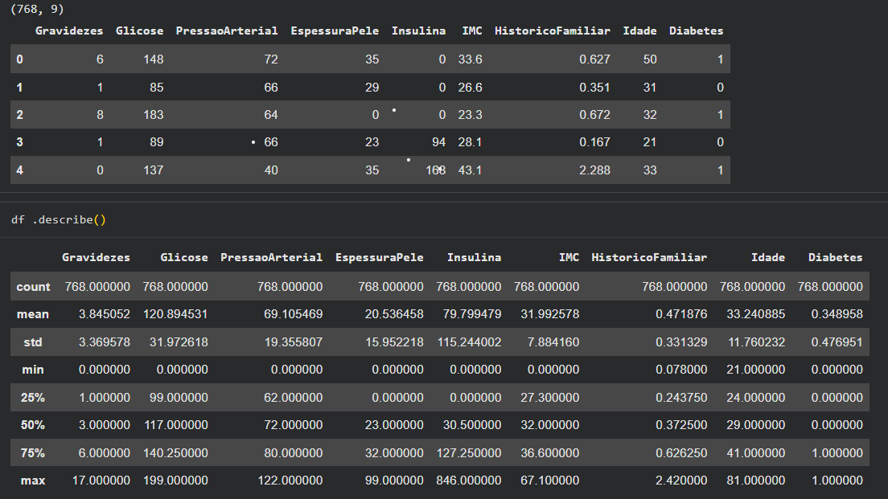

> As colunas de Glicose, PressaoArterial, IMC, EspessuraPele e Insulina tinham zeros impossíveis — ninguém pode ter glicose ou pressão arterial zero e estar vivo. Esses valores representam dados faltantes codificados como zero.
>
> Como estratégia adotada então, optamos pela substituição por `NaN` seguida de imputação pela mediana de cada coluna. A mediana foi escolhida por ser resistente a outliers (diferente da média), preservando melhor a tendência central dos dados sem distorcer a distribuição original.

---

### 2.2 Modelagem: treinem no mínimo 3 modelos diferentes com validação cruzada. Lembrem do que aprenderam: alguns precisam de escalonamento, outros não.

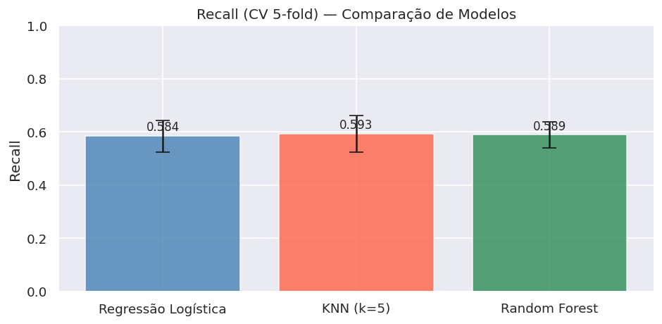

> Três modelos diferentes treinados usando cross-validation de 5 folds com a métrica Recall:
>
> - **Regressão Logística:** modelo linear simples, boa baseline. Exige escalonamento pois é sensível à escala das features.
> - **KNN:** aprende por similaridade entre vizinhos. Muito sensível à escala — sem normalização, features com valores maiores dominariam a distância euclidiana. Por isso, usado `Pipeline` com `StandardScaler`.
> - **Random Forest:** ensemble de árvores de decisão. Não exige escalonamento pois usa limiares em features individuais, não distâncias. É robusto e interpretável.

---

### 2.3 Avaliação: matriz de confusão + precisão/recall do melhor modelo. Pergunta-chave: num teste de diabetes, qual erro é mais grave — falso positivo ou falso negativo? Sua escolha de métrica deve refletir isso.

> O melhor modelo foi o Random Forest

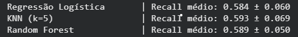

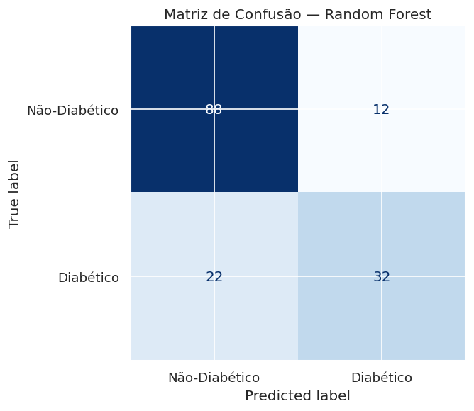

> **Qual erro é mais grave num teste de diabetes?**
>
> O **falso negativo** é o erro mais grave. Um diabético não diagnosticado continua sem tratamento, o que pode levar a complicações sérias como cegueira, insuficiência renal e amputações.
>
> O **falso positivo** resulta em mais exames confirmatórios — incômodo e custo, mas sem risco de vida.
>
> Por isso, a métrica principal foi o **Recall** (sensibilidade): maximizar a detecção dos casos positivos reais, aceitando mais falsos alarmes se necessário.

---

### 2.4 Interpretação: qual variável mais prediz diabetes? Faz sentido clínico? Escrevam 2-3 frases conectando o resultado do modelo com o mundo real.

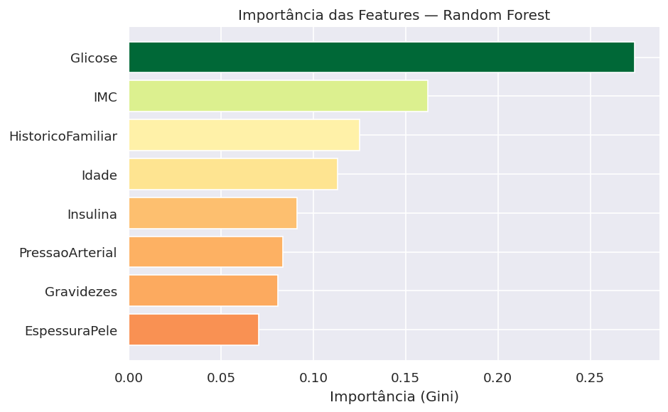

> As variáveis mais importantes identificadas pelo modelo foram Glicose, IMC e Histórico Familiar. Esse resultado faz sentido clinicamente, pois a glicose é o principal indicador utilizado no diagnóstico do diabetes, estando diretamente relacionada à doença. O IMC também é um fator relevante, já que o excesso de peso aumenta a resistência à insulina e eleva o risco de desenvolvimento do diabetes tipo 2. Além disso, o histórico familiar reflete a predisposição genética para a doença, sendo um fator de risco amplamente reconhecido pela literatura médica.

> Dessa forma, o modelo está aprendendo padrões compatíveis com o conhecimento médico já estabelecido, o que aumenta a confiança na qualidade e na interpretação de suas previsões.

---

## Questão 3 — Dataset de Sementes de Trigo (Seeds)

### 3.1 Apliquem o método do cotovelo. Quantos grupos os dados sugerem? Justifiquem com o gráfico.

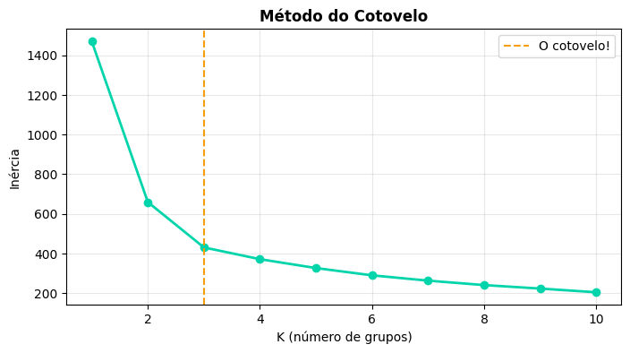

> Aplicando o Método do Cotovelo, observou-se que a inércia diminui acentuadamente de k=1 até k=3. A partir desse ponto, a redução passa a ser bem menor, indicando ganhos marginais ao aumentar o número de grupos.
>
> O **"cotovelo"** ocorre em **k = 3**, sugerindo que os dados possuem três agrupamentos naturais. Essa escolha representa um bom equilíbrio entre simplicidade e capacidade de representar a estrutura dos dados.

---

### 3.2 K-Means com Visualização PCA

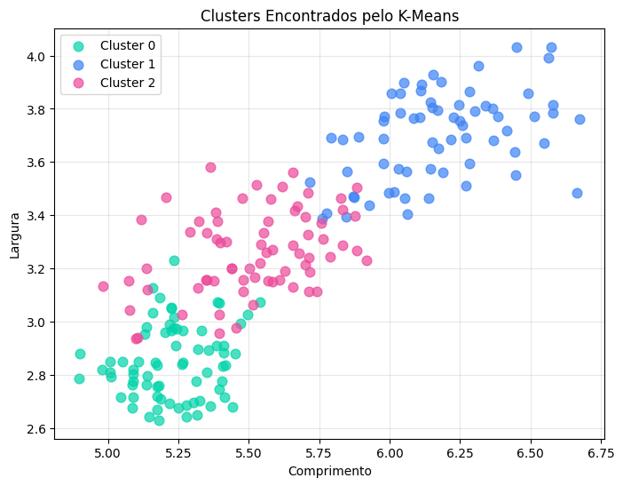

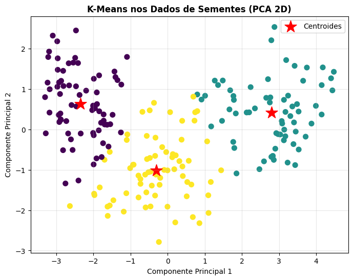

---

### 3.3 Caracterizem cada grupo (qual o grão "médio" de cada cluster?) e proponham uma aplicação real: como uma cooperativa agrícola usaria essa segmentação?

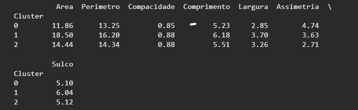

> Os clusters representam diferentes perfis de sementes de trigo:
> - Um grupo reúne grãos **maiores**, com maior área e perímetro.
> - Outro contém grãos **menores e mais compactos**.
> - O terceiro apresenta **características intermediárias** e diferenças no formato.
>
> **Aplicação real:** Uma cooperativa agrícola poderia usar essa segmentação para classificar automaticamente os lotes de trigo, melhorar o controle de qualidade, separar produtos por padrão e definir estratégias de comercialização e armazenamento mais adequadas para cada tipo de grão.

---

## Questão 4 — Diagnóstico de Overfitting

### 4.1 Treinem uma árvore de decisão e plotem acurácia de treino vs teste para profundidades de 1 a 20 (a "curva do overfitting"). Identifiquem visualmente: onde começa o overfitting?

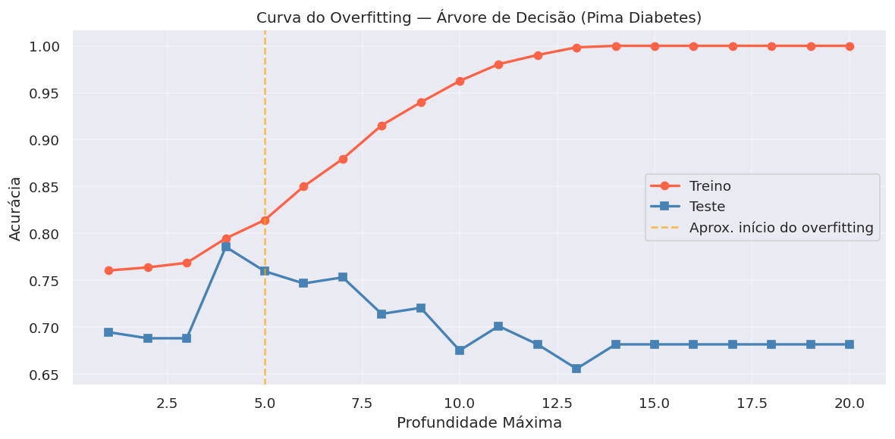

> A curva mostra o padrão clássico de overfitting:
> - Nas profundidades baixas, ambas as curvas sobem juntas — o modelo ainda está aprendendo padrões reais.
> - A partir de aproximadamente profundidade **5–7**, a acurácia de treino continua subindo (chegando a 100%) enquanto a acurácia de teste estabiliza ou cai.
> - Essa divergência é a **assinatura visual do overfitting**: o modelo memoriza o treino em vez de generalizar.

---

### 4.2 Qual a profundidade ideal? Justifiquem usando validação cruzada, não o olhômetro.

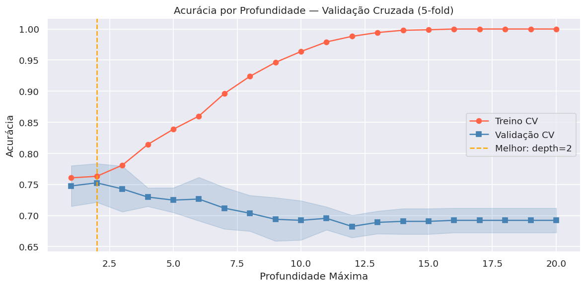

> Usamos `GridSearchCV` com 5-fold cross-validation para testar sistematicamente todas as profundidades de 1 a 20. A profundidade ideal é aquela que maximiza a acurácia na **validação**, não no treino.

> A validação cruzada é mais confiável do que o "olhômetro" porque:
> - Avalia o modelo em 5 subconjuntos diferentes do treino, reduzindo a variância da estimativa.
> - O resultado reflete melhor a performance real em dados não vistos.
> - É um método reproduzível e objetivo.

---

### 4.3 O que é Overfitting? (Com Nossas Palavras)

> Overfitting é quando o modelo **memorizou** os dados de treino — incluindo suas particularidades — em vez de aprender os padrões gerais. É como estudar redação para o ENEM decorando várias redações prontas, mas sem saber adaptá-las para outros temas.

> **3 técnicas para combater overfitting:**

> 1. **Limitar a complexidade do modelo** — no caso de árvores, definir um `max_depth`. Isso impede que o modelo crie galhos muito específicos para casos individuais do treino.
> 2. **Regularização (L1/L2)** — penaliza coeficientes muito altos, forçando o modelo a ser mais simples. É como colocar um limite no quanto ele pode "confiar" em qualquer feature individual.
> 3. **Validação cruzada + mais dados** — com mais exemplos variados de treino, fica mais difícil memorizar. E a cross-validation garante que avaliamos a generalização antes de tomar decisões.

---

## Questão 5 — Uso Crítico de LLM

### 5.1 Prompts utilizados

> **Prompt 1:** Pedi ao ChatGPT para readequar um código de PCA utilizado para classificações de vinho à classificação de trigos.

> **Prompt 2:** Pedi ao ChatGPT para me relembrar a sintaxe da escalação de dados.

---

### 5.2 Erros do LLM

> O ChatGPT associou a classificação supervisionada a conceitos e fórmulas da estatística ao invés de associar à machine learning.

---

### 5.3 Decisão 100% nossa

> As técnicas e métricas da **Questão 1** foram escolha nossa, pois a LLM julgava a partir de conhecimentos muito específicos, dos quais não tínhamos propriedade suficiente para validar automaticamente — exigiu julgamento próprio sobre o contexto de cada problema.
